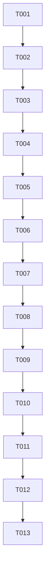

# Implementation Tasks: Scan Mode Configuration Distribution

**Feature**: Scan Mode Configuration Distribution
**Branch**: `002-scan-mode-config`
**Spec**: [spec.md](./spec.md) | **Plan**: [plan.md](./plan.md)

## Tasks Overview

Total Tasks: 13
- Phase 1 (Setup & Model): 3 tasks
- Phase 2 (Foundational Services): 2 tasks
- Phase 3 (User Story 1 - Admin Selects & Pushes Config): 4 tasks
- Phase 4 (User Story 2 - Connection Handshake Auto-Sync): 2 tasks
- Phase 5 (Polish & Automated Verification): 2 tasks

---

## Phase 1: Setup & Data Model

- [x] T001 Create SQLAlchemy database model `ScanModeSetting` in `backend/app/models/scan_mode.py`
- [x] T002 Create Pydantic request & response schemas `ScanModeCreateRequest` and `ScanModeResponse` in `backend/app/schemas/scan_mode.py`
- [x] T003 Update `backend/app/db/init_db.py` to import `ScanModeSetting` and seed baseline scan mode profiles ("Quick Scan", "Full System Scan", "Custom / Deep Scan")

---

## Phase 2: Foundational Services

- [x] T004 Implement `ScanModeService` in `backend/app/services/scan_mode_service.py` for retrieving active scan mode and updating settings in database
- [x] T005 Update `backend/app/services/broadcast.py` to format and broadcast `SYNC_SCAN_MODE` JSON payload to active agents and `UPDATE_SCAN_MODE` to dashboard

---

## Phase 3: User Story 1 (P1) - Admin Selects & Pushes Scan Mode Config

- [x] T006 [US1] Create REST API router in `backend/app/api/v1/scan_mode.py` providing `GET /api/v1/scan-mode` and `POST /api/v1/scan-mode`
- [x] T007 [US1] Mount `scan_mode.router` in `backend/app/main.py` under `/api/v1/scan-mode`
- [x] T008 [US1] Create React component `ScanModeTab.jsx` in `frontend/src/components/tabs/ScanModeTab.jsx` with preset selection, configuration parameters form, JSON preview card, and "Deploy Config to Agents" button
- [x] T009 [US1] Wire `ScanModeTab` into `frontend/src/components/Dashboard.jsx` navigation bar

---

## Phase 4: User Story 2 (P2) - Automatic Connection Handshake Sync

- [x] T010 [US2] Update `agent_websocket_endpoint` in `backend/app/api/websockets/agent_ws.py` to auto-push current active scan mode payload on new Agent connection handshake and process `ACK_SCAN_MODE_SYNC`
- [x] T011 [US2] Update `backend/scripts/agent_simulator.py` to listen for `SYNC_SCAN_MODE` events and respond with `ACK_SCAN_MODE_SYNC` payload

---

## Phase 5: Polish & Automated Verification

- [x] T012 Create integration tests in `backend/tests/integration/test_scan_mode_api.py` covering REST endpoints, database persistence, and WebSocket broadcast
- [x] T013 Verify production frontend build (`npm run build`) and backend tests (`pytest`) pass cleanly

---

## Dependency Graph & Story Completion Order

## MVP Scope
Tasks T001 through T009 constitute the Minimum Viable Product (MVP) delivering full Admin UI selection and WebSocket distribution to active connected agents.
