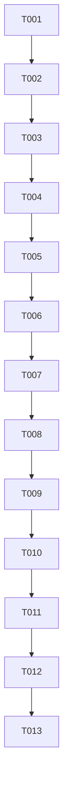

# Implementation Tasks: IP Blocking & Unblocking Command Dispatch

**Feature**: IP Blocking & Unblocking Command Dispatch
**Branch**: `003-ip-block-control`
**Spec**: [spec.md](./spec.md) | **Plan**: [plan.md](./plan.md)

## Tasks Overview

Total Tasks: 13
- Phase 1 (Setup & Model): 3 tasks
- Phase 2 (Foundational Services): 2 tasks
- Phase 3 (User Story 1 - Admin Dispatches IP Block Command): 4 tasks
- Phase 4 (User Story 2 & 3 - Connection Handshake Sync & Simulator ACK): 2 tasks
- Phase 5 (Polish & Automated Verification): 2 tasks

---

## Phase 1: Setup & Data Model

- [x] T001 Create/verify SQLAlchemy database model `IpRule` in `backend/app/models/ip_rule.py`
- [x] T002 Create Pydantic request & response schemas `IpRuleCreateRequest`, `IpUnblockRequest`, and `IpRuleResponse` with IP address validation in `backend/app/schemas/ip_rule.py`
- [x] T003 Update `backend/app/db/init_db.py` to import `IpRule` and seed baseline sample IP firewall rule

---

## Phase 2: Foundational Services

- [x] T004 Implement `IpBlockService` in `backend/app/services/ip_block_service.py` for creating block rules, unblocking rules, querying active rules, and updating rule status
- [x] T005 Update `backend/app/services/broadcast.py` to format and broadcast `COMMAND_IP_BLOCK` and `COMMAND_IP_UNBLOCK` JSON payloads to targeted agents

---

## Phase 3: User Story 1 (P1) - Admin Dispatches IP Block Command

- [x] T006 [US1] Create REST API router in `backend/app/api/v1/ip_block.py` providing `GET /api/v1/ip-block`, `POST /api/v1/ip-block`, and `POST /api/v1/ip-block/unblock`
- [x] T007 [US1] Mount `ip_block.router` in `backend/app/main.py` under `/api/v1/ip-block`
- [x] T008 [US1] Create/upgrade React component `IpBlockTab.jsx` in `frontend/src/components/tabs/IpBlockTab.jsx` with IP block form, target agent dropdown, active rules table, unblock button, and JSON preview card
- [x] T009 [US1] Wire `IpBlockTab` into `frontend/src/components/Dashboard.jsx` navigation bar

---

## Phase 4: User Story 2 & 3 (P2/P3) - Handshake Sync & Simulator ACK

- [x] T010 [US2] Update `agent_websocket_endpoint` in `backend/app/api/websockets/agent_ws.py` to auto-push active IP block rules during connection handshake and process `ACK_IP_BLOCK` / `ACK_IP_UNBLOCK` frames
- [x] T011 [US3] Update `backend/scripts/agent_simulator.py` to listen for `COMMAND_IP_BLOCK` / `COMMAND_IP_UNBLOCK` events and respond with `ACK_IP_BLOCK` / `ACK_IP_UNBLOCK`

---

## Phase 5: Polish & Automated Verification

- [x] T012 Create integration tests in `backend/tests/integration/test_ip_block_api.py` covering IP format validation, REST endpoints, database persistence, and WebSocket command dispatch
- [x] T013 Verify production frontend build (`npm run build`) and backend tests (`pytest`) pass cleanly

---

## Dependency Graph & Story Completion Order

## MVP Scope
Tasks T001 through T009 constitute the Minimum Viable Product (MVP) delivering full Admin UI command dispatch and WebSocket delivery to active connected agents.
